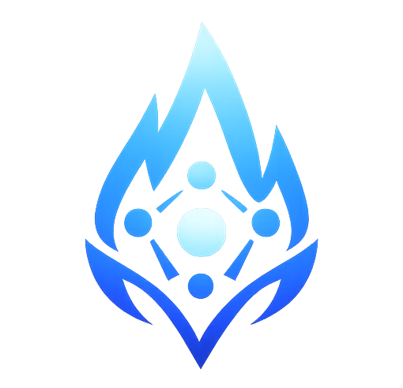
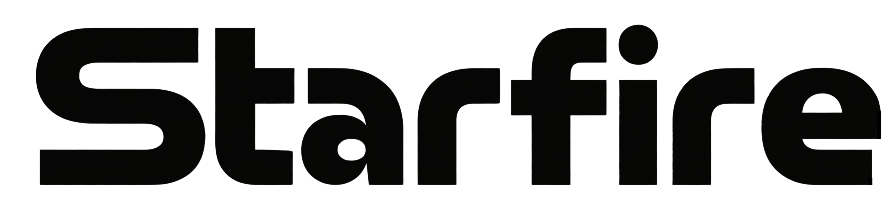

<div align="center">

<p>
  
</p>

<p>
  <picture>
    <source media="(prefers-color-scheme: dark)" srcset="./docs/assets/branding/starfire-text-white.png">
    
  </picture>
</p>

<p>
  <a href="./README.md">English</a> | <a href="./README.zh-CN.md">中文</a>
</p>

<h3>面向异构 AI Agent 团队的组织级控制平面</h3>

<p>
  构建真正的 AI 组织，而不是脆弱的 agent demo。
</p>

[](https://opensource.org/licenses/MIT)
[](https://golang.org/)
[](https://www.python.org/)
[](https://nextjs.org/)

<p>
  Visual Canvas • Runtime Compatibility • Hierarchical Memory • Skill Evolution • Operational Guardrails
</p>

<p>
  <a href="./docs/index.md"><strong>文档首页</strong></a> •
  <a href="./docs/quickstart.md"><strong>快速开始</strong></a> •
  <a href="./docs/architecture/architecture.md"><strong>系统架构</strong></a> •
  <a href="./docs/api-protocol/platform-api.md"><strong>Platform API</strong></a> •
  <a href="./docs/agent-runtime/workspace-runtime.md"><strong>Workspace Runtime</strong></a>
</p>

[](https://railway.app/new/template?template=https://github.com/ZhanlinCui/Starfire-AgentTeam)
[](https://render.com/deploy?repo=https://github.com/ZhanlinCui/Starfire-AgentTeam)

</div>

---

## 一句话定位

Starfire 是 **agent framework** 和 **生产级运维控制面** 之间缺失的那一层。

今天大多数团队通常只能把一件事做得很好：

- 搭一个 workflow
- 做一个很强的单 agent
- 拼一个自定义 multi-agent graph
- 在本地跑一个 coding agent

但很少有团队能同时做到这些：

- 让多种 agent 架构并存
- 把它们组织成真实角色和团队
- 让 memory 边界跟组织结构保持一致
- 在一个控制平面里完成观测、重启、暂停、排障和治理

Starfire 就是为这个场景设计的。

## 为什么 Starfire 很不一样

### 1. 节点是角色，不是任务

在 Starfire 里，workspace 是一个组织角色。这个角色今天可以是单 agent，明天可以扩成内部子团队，而且对外身份、层级位置、memory 边界和 A2A 接口都不变。

### 2. 组织图就是拓扑

你不需要手动画协作边。层级天然决定默认协作路径。这里的组织结构不是装饰性 UI，而是运行模型本身的一部分。

### 3. Runtime 选择不再是死路

LangGraph、DeepAgents、Claude Code、CrewAI、AutoGen、OpenClaw 都可以挂到同一个 workspace abstraction 下。团队可以统一治理方式，而不必统一到底层 runtime。

### 4. Memory 被当成基础设施来做

Starfire 的 HMA 不是“多存一点上下文”而已。它关注组织边界、durable recall、scope sharing、awareness namespace、skill promotion，把这些放在一个完整体系里。

### 5. 它自带真正的 control plane

Registry、heartbeat、restart、pause/resume、activity、approval、terminal、files、traces、bundles、templates、WebSocket fanout 都不是补丁，而是平台一等能力。

## Starfire 填补了什么市场空白

| 类别 | 擅长什么 | 通常卡在哪里 | Starfire 补上的部分 |
|---|---|---|---|
| Workflow builder | 可视化任务编排 | 节点是任务，不是持久组织角色 | 角色原生 workspace、层级结构、长期团队 |
| Agent framework | Runtime 语义强 | 缺统一 control plane 和组织级运维 | 生命周期、Canvas、registry、策略、observability |
| Coding agent | 本地执行很强 | 不适合直接当团队基础设施 | Workspace abstraction、A2A 协作、平台化运维 |
| 自定义 multi-agent graph | 灵活度高 | 拓扑脆弱、治理分散 | 在保留 runtime 自由度的同时统一 operating model |

## Starfire 的可防御优势

| 优势 | 为什么重要 |
|---|---|
| **角色原生 workspace 抽象** | 模型切换、框架切换、团队扩容都不会打碎你的组织结构 |
| **分形式团队扩展** | 一个 specialist 可以平滑升级成一个部门，而不影响上游集成 |
| **异构 runtime 兼容** | 不同团队可以保留偏好的 agent 架构，但共用一套平台规则 |
| **HMA + awareness namespace** | Memory 分享沿组织边界走，而不是全局乱穿透 |
| **Skill 演化闭环** | 成功工作流可以从 memory 逐步提升成可热加载的 skill |
| **WebSocket-first 运维体验** | Canvas 能即时反映任务状态、结构变更和 A2A 响应 |
| **Global secrets + local override** | 统一管理 provider 凭据，只在需要时做 workspace 级覆写 |

## 兼容哪些 Agent 架构，怎么对比

Starfire 并不是要替代下面这些 framework，而是把它们纳入更强的组织级 operating model。

| Runtime / 架构 | 当前仓库状态 | 原生优势 | Starfire 额外补上的能力 |
|---|---|---|---|
| **LangGraph** | `main` 已支持 | 图控制强、工具调用成熟、Python 扩展性好 | Canvas orchestration、层级路由、A2A、memory scope、operational lifecycle |
| **DeepAgents** | `main` 已支持 | 规划和任务拆解更强 | 同一套 workspace contract、团队拓扑、activity、restart 行为 |
| **Claude Code** | `main` 已支持 | 真实编码工作流、CLI-native continuity | 安全 workspace 抽象、A2A delegation、组织边界、共享 control plane |
| **CrewAI** | `main` 已支持 | 角色型 crew 模式清晰 | 持久 workspace 身份、统一策略、共享 Canvas 和 registry |
| **AutoGen** | `main` 已支持 | assistant/tool orchestration | 统一部署、层级协作、共享运维平面 |
| **OpenClaw** | `main` 已支持 | CLI-native runtime，自有 session 模型 | workspace 生命周期、templates、activity logs、拓扑感知协作 |
| **NemoClaw** | `feat/nemoclaw-t4-docker` 分支 WIP | NVIDIA 方向 runtime 路线 | 计划并入同一抽象层，但当前还不是 `main` 已合并能力 |

核心价值就是：**多种 agent runtime，共用一套组织级操作系统**。

## 为什么我们的 Memory 架构会越跑越强

很多项目停留在“加了 memory”。Starfire 走得更远：

| 常见 memory 方案 | Starfire |
|---|---|
| 扁平 store 或弱命名空间隔离 | 与层级对齐的 `LOCAL`、`TEAM`、`GLOBAL` scope |
| 分享很容易越界 | 分享是显式且结构感知的 |
| Memory 和 procedure 混成一团 | Memory 存 durable facts，skills 存 repeatable procedure |
| 任意 agent 容易过权 | workspace awareness namespace 缩小 blast radius |
| UI memory 和 runtime memory 混在一起 | scoped agent memory、key/value workspace memory、recall surface 分层清晰 |

### 这套飞轮怎么转

```text
任务执行
   -> durable insight 进入 memory
   -> 重复成功变成 signal
   -> workflow 提升成 skill
   -> skill 热加载回 runtime
   -> 后续协作更快、更稳
```

这正是 Starfire 最强的长期价值之一：系统会越来越像一个组织，而不是越来越像一段越来越大的隐藏 prompt。

## Starfire 内建的自我进化式 Agent Team 架构

很多 agent 系统停留在“runtime 很聪明”。Starfire 往前走了一步: 它让团队可以**把有效经验写入 durable memory，把稳定 workflow 提升成 skill，把这些改进热加载回 live workspace，并且让整条闭环在平台层可见、可治理、可复用**。

| 对比维度 | 常见自我进化 agent 模式 | Starfire |
|---|---|---|
| **进化单元** | 单个 agent session 或 runtime | 一个 workspace、一个团队，最终到整张组织图谱 |
| **运维可见面** | 主要隐藏在 agent 内部循环里 | 可被平台、Canvas、activity stream、memory surface、runtime controls 共同观察和治理 |
| **战略结果** | 一个更聪明的 agent | 一个会持续复利、沉淀 durable knowledge 和 governed skills 的 AI 组织 |

### 在 Starfire 里，这条闭环落在哪些模块

| 核心机制 | Starfire 对应模块 | 为什么重要 |
|---|---|---|
| **跨 session 的 durable memory** | `workspace-template/tools/memory.py`、`workspace-template/tools/awareness_client.py`、`platform/internal/handlers/memories.go` | 不只是持久化，而且是**按 workspace 隔离**的，可进一步路由到和组织结构绑定的 awareness namespace |
| **Cross-session recall** | `platform/internal/handlers/activity.go` 中的 `/workspaces/:id/session-search` | Recall 同时覆盖 activity history 和 memory rows，不需要再造一个隐蔽的新存储层 |
| **从经验里长出技能** | `workspace-template/tools/memory.py` 里的 `_maybe_log_skill_promotion` | 从 memory 到 skill candidate 的提升会被显式记录成平台 activity，而不是默默发生在黑盒里 |
| **技能在使用中持续改进** | `workspace-template/skills/watcher.py`、`workspace-template/skills/loader.py`、`workspace-template/main.py` | Skill 改动可以热加载进 live runtime，下一次 A2A 任务就能直接使用，不需要重启 workspace |
| **持久化 skill 生命周期** | `platform/cmd/cli/cmd_agent_skill.go`、`workspace-template/plugins.py` | Skill 不只是“生成一次”，而是可以 audit、install、publish、plugin 挂载、治理和复用的正式资产 |

### 为什么这在 Starfire 里更适合团队级系统

1. **学习闭环是 org-aware 的，而不只是 session-aware。**
   Memory 可以按 `LOCAL`、`TEAM`、`GLOBAL` scope 运作，awareness namespace 让每个 workspace 都有清晰的持久边界。

2. **学习闭环是对运维可见的。**
   Promotion events、activity logs、current-task updates、traces、WebSocket fanout 让自我进化进入 control plane，而不是藏在黑盒内部。

3. **学习闭环是可以跨团队复利的。**
   某个 workspace 学出来的稳定 workflow 可以变成受治理的 skill，热加载回 runtime，写进 Agent Card，并继续服务更大的组织层级。

所以 Starfire 的目标不只是“一个会学习的 agent”，而是**一个会随着工作沉淀出 durable memory 和 reusable procedure、并持续变强的 AI 组织**。

## `main` 分支已经具备什么

### Canvas

- Next.js 15 + React Flow + Zustand
- drag-to-nest 团队构建
- empty state + onboarding wizard
- template palette
- bundle import/export
- 包含 chat、activity、details、skills、terminal、config、files、memory、traces、events 的 10 个侧栏 tab

### Platform

- Go/Gin control plane
- workspace CRUD 和 provisioning
- registry 与 heartbeat
- 浏览器安全的 A2A proxy
- team expansion/collapse
- activity logs 与 approvals
- secrets 和 global secrets
- files API、terminal、bundles、templates、viewport persistence

### Runtime

- 统一 `workspace-template/` 镜像
- adapter 驱动执行
- Agent Card 注册
- awareness-backed memory
- plugin 挂载共享 rules/skills
- 本地 skills 热加载
- coordinator-only delegation 路径

### Ops

- Langfuse traces
- current-task reporting
- pause/resume/restart
- activity streaming
- runtime tiers
- 终端与文件层面的 workspace 直接排障

## 适合什么团队

Starfire 特别适合下面这些场景：

- 需要 PM / Dev Lead / QA / Research / Ops 等角色协作的 AI 工程团队
- 不同子团队偏好不同 agent runtime 的组织
- 需要长期 memory 边界和技能沉淀的 agent 系统
- 想把 agent team 作为正式基础设施，而不是零散脚本的内部平台团队

## 架构总览

```text
Canvas (Next.js :3000)  <--HTTP / WS-->  Platform (Go :8080)  <---> Postgres + Redis
         |                                          |
         |                                          +--> Docker provisioner / bundles / templates / secrets
         |
         +-------------------- 展示 --------------------> workspaces, teams, tasks, traces, events

Workspace Runtime (Python image with adapters)
  - LangGraph / DeepAgents / Claude Code / CrewAI / AutoGen / OpenClaw
  - Agent Card + A2A server
  - heartbeat + activity + awareness-backed memory
  - skills + plugins + hot reload
```

## 快速开始

```bash
git clone https://github.com/ZhanlinCui/Starfire-AgentTeam.git
cd Starfire-AgentTeam

./infra/scripts/setup.sh

cd platform
go run ./cmd/server

cd ../canvas
npm install
npm run dev
```

然后打开 `http://localhost:3000`：

1. 在 empty state 中部署模板，或者创建 blank workspace。
2. 跟着 onboarding guide 进入 `Config`。
3. 在 `Secrets & API Keys` 中添加 provider key。
4. 打开 `Chat` 并发送第一条任务。

## 文档导航

- [文档首页](./docs/index.md)
- [快速开始](./docs/quickstart.md)
- [产品概览](./docs/product/overview.md)
- [系统架构](./docs/architecture/architecture.md)
- [记忆架构](./docs/architecture/memory.md)
- [Platform API](./docs/api-protocol/platform-api.md)
- [Workspace Runtime](./docs/agent-runtime/workspace-runtime.md)
- [Canvas UI](./docs/frontend/canvas.md)
- [本地开发](./docs/development/local-development.md)

## 当前范围说明

当前 `main` 已经包含核心平台、Canvas、memory model、6 个正式 adapter、skill lifecycle 和主要运维面。像 **NemoClaw** 这样的相邻 runtime 路线仍然属于分支级工作，只有合并后才会进入正式支持列表，这里会明确区分。

## License

MIT
